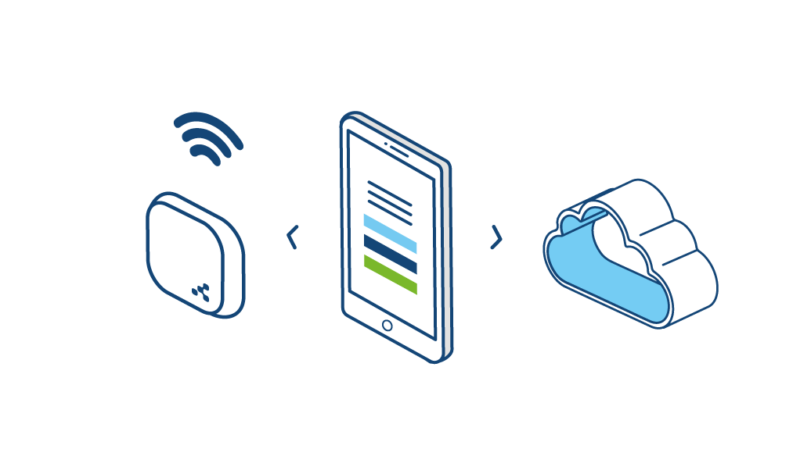
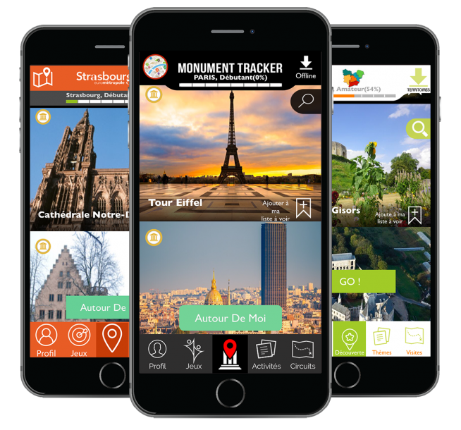

# IoTSkill

## Objectif
L'objectif du projet est de placer des "beacons" sur les monuments d'Aix-en-Provence.

Ces beacons proposeront des informations à propos des monuments.

Les informations seront récupérées par l'application mobile existante d'Aix-en-Provence.

1. Utilisation de plusieurs capteurs, idéalement déjà présent sur la carte

Capteur de mouvement pour compter le nombre de visiteurs pour chaque monument.

2. 1 actuateur

L'actuateur serait un détecteur de mouvement.

3. Une logique business d'exploitation des données

Les données du nombre de visiteurs pourraient éventuellement être récupérées par un utilisateur "admin" de l'application ou autres transmissions.
Ces données pourraient être utiles pour savoir quels sont les monuments les plus appréciés.

4. Une boucle de rétroaction pour activer l'actuateur et avoir un - impact sur l'objet

Quand le détecteur de mouvement détecterait un passant, il augmenterai une variable correspondant au nombre de visiteurs et par exemple pourrait faire clignoter une LED.

5. Une logique d'analyse d'impact pour mesurer l'impact

Collecter des données d'utilisation de l'application, notamment l'utilisation de la fonctionnalité beacon.
