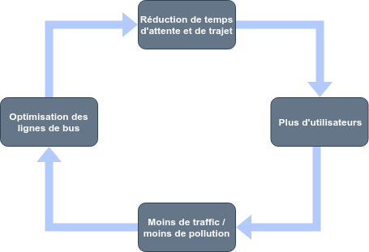

# IoTSkill

## Objectif

L'objectif est d'optimiser les temps d'attentes et la durée des trajets tout en réduisant la pollution émise par le traffic.

### 1. Utilisation de plusieurs capteurs, idéalement déjà présent sur la carte

- Capteur de proximité dans les arrêts de bus

### 2. Actuateur

- Bip cartes

### 3. Une logique business d'exploitation des données

Les clients bip à l'arrêt, dans le bus et à la sortie.
Cela nous permettra de déterminer le temps d'attente et la durée du trajet.
Nous promouvoyons un temps d'attente plus faible, avec des horaires plus adaptés aux utilisateurs ce qui permet d'avoir plus d'utilisateurs, moins de traffic, moins de pollution et donc nous pouvons nous engager sur un temps de trajet moyen, ce qui attirera plus d'utilisateurs ... = cercle vertueux.

L'objectif ultime en terme de business model serait de proposer une carte qui fonctionne de tel manière : l'utilisateur n'aurait pas à payer si le temps de trajet n'est pas respecté. Il s'agit d'un business model basé sur l'engagement.

### 4. Une logique d'analyse d'impact pour mesurer l'impact

- Fluctuation des statistiques avant - après

### Idées

- Transport "volant" cela permet de pallier aux besoins ponctuels lors d'évenements (festivals, concerts ...) rapportés par les capteurs qui détectent des changements de comportement.
